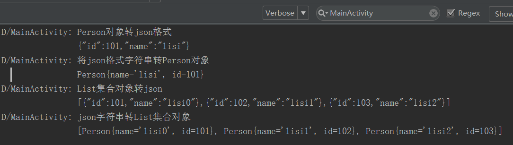
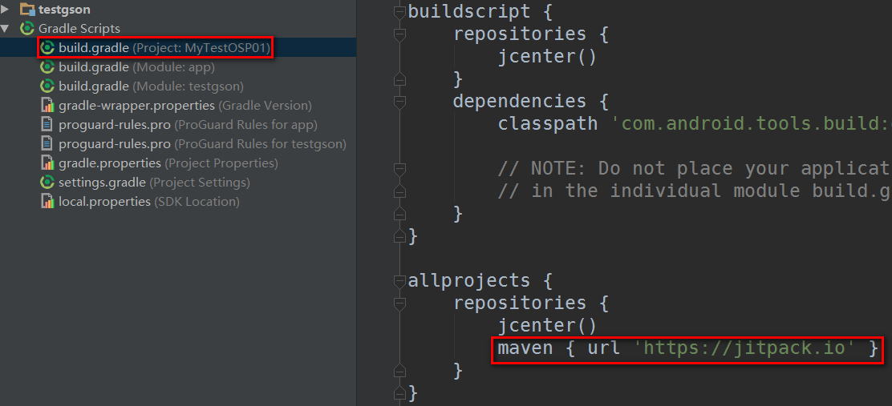

#google开源项目Gson使用简介
开源地址：[https://github.com/open-android/Gson](https://github.com/open-android/Gson "开源项目地址")

 PS：如果觉得文章太长，你也可观看该课程的[视频](https://www.boxuegu.com/web/html/video.html?courseId=172&sectionId=8a2c9bed5a3a4c7e015a3bbffc6107ed&chapterId=8a2c9bed5a3a4c7e015a3affbed40469&vId=8a2c9bed5a3a4c7e015a3bddf83c0862&videoId=43F77AE0DB66FB6C9C33DC5901307461)，亲，里面还有高清，无码的福利喔

# 转换效果

* 爱生活,爱学习,更爱做代码的搬运工,分类查找更方便请下载黑马助手app

## 使用步骤

### 1. 在project的build.gradle添加如下代码(如下图)

	allprojects {
	    repositories {
	        ...
	        maven { url "https://jitpack.io" }
	    }
	}

### 2. 在Module的build.gradle添加依赖

    compile 'com.github.open-android:Gson:2.8'

### 3.演示步骤

* a.编写测试类Person

		package com.itheima.gson;
		
		
		/**
		 * Gson转换测试类
		 */
		public class Person {
		    private String name;
		    private int id;
		
		    public Person() {
		
		    }
		
		    public Person(String name, int id) {
		        this.name = name;
		        this.id = id;
		    }
		
		    public String getName() {
		        return name;
		    }
		
		    public void setName(String name) {
		        this.name = name;
		    }
		
		    public int getId() {
		        return id;
		    }
		
		    public void setId(int id) {
		        this.id = id;
		    }
		
		    @Override
		    public String toString() {
		        return "Person{" +
		                "name='" + name + '\'' +
		                ", id=" + id +
		                '}';
		    }
		}

* b.Gson用法演示代码复制到Activity的onCreate方法

	        //创建Gson对象
	        Gson gson = new Gson();
	
	        //1.Gson实现对象和json相互转换
	        //toJson方法将Person对象转json格式
	        Person person = new Person("lisi", 101);
	
	        String json = gson.toJson(person);
	
	        if (BuildConfig.DEBUG) Log.d("MainActivity", "Person对象转json格式\n" + json);
	
	
	        //fromJson方法将json格式字符串转Person对象
	        Person person1 = gson.fromJson(json, Person.class);
	        
	        if (BuildConfig.DEBUG) Log.d("MainActivity", "将json格式字符串转Person对象\n"+person1.toString());
	
	
	        //2.Gson实现List集合对象和json格式相互转换
	        List<Person> persons = new ArrayList<Person>();
	
	        for(int i = 0;i < 3;i++){
	            Person p = new Person("lisi" + i, 101 + i);
	            persons.add(p);
	        }
	
	        //toJson方法将List集合对象转json
	        String json1 = gson.toJson(persons);
	        if (BuildConfig.DEBUG) Log.d("MainActivity", "List集合对象转json\n"+json1);
	
	        //fromJson方法将json字符串转List集合对象
	        List<Person> lists = gson.fromJson(json1,
	                new TypeToken<List<Person>>(){}.getType());//泛型类型会被擦擦除
	
	        if (BuildConfig.DEBUG) Log.d("MainActivity", "json字符串转List集合对象\n" + lists.toString());

* 详细的使用方法在DEMO里面都演示啦,如果你觉得这个库还不错,请赏我一颗star吧~~~

* 欢迎关注微信公众号

